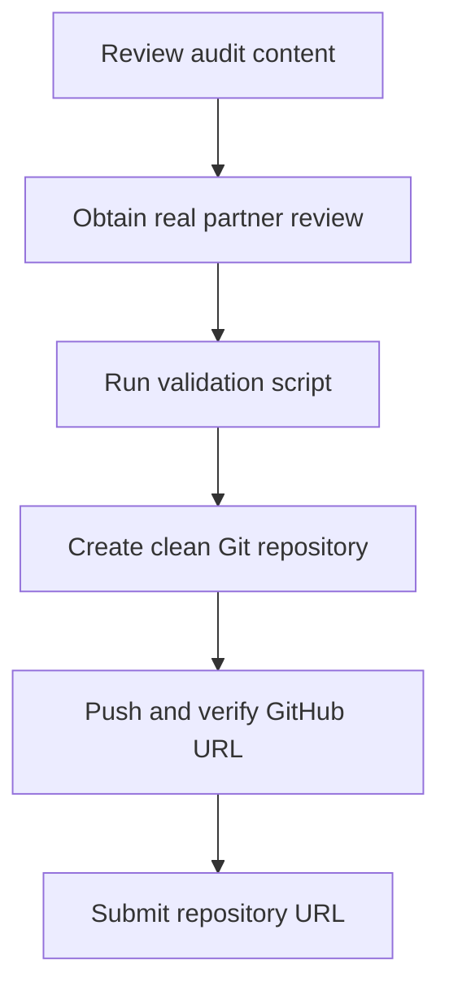

# GitHub Submission Workflow

## 1. Final repository structure

```text
gdpr-privacy-audit-eu-tender-agent/
├── README.md
├── GDPR_Privacy_Audit_Pack_EU_Tender_Autonomous_Agent_Walid_Barakat.md
├── Client_Recommendation_Memo_iAtWork_EU_Tender_Agent.md
├── DPIA_and_Privacy_by_Design_Appendix_EU_Tender_Agent.md
├── Partner_Peer_Review_Rubric_EU_Tender_Privacy_Audit.md
├── Submission_Workflow_GitHub_Privacy_Lab.md
├── references/
│   └── Official_EU_Legal_Sources.md
└── scripts/
    └── validate_submission.sh
```

Do not add the main EU Tender Agent repository, unrelated course materials, API keys, `.env` files, exported credentials, personal documents, archives of earlier projects or system dumps.

## 2. Workflow overview



## 3. Complete the human review

Send `Client_Recommendation_Memo_iAtWork_EU_Tender_Agent.md` to the partner. The partner completes:

```text
Partner_Peer_Review_Rubric_EU_Tender_Privacy_Audit.md
```

Do not delete the pending-review notice until the reviewer has entered their name, scores, comments and client response.

## 4. Validate locally on macOS

Open Terminal or the VS Code terminal, then enter the extracted folder:

```bash
cd "/path/to/GDPR_Privacy_Lab_EU_Tender_Agent_Walid_Barakat"
chmod +x scripts/validate_submission.sh
bash scripts/validate_submission.sh
```

Resolve every error before committing. A warning about pending partner review is expected until the genuine review is completed.

## 5. Create the Git repository

```bash
git init
git branch -M main
git add README.md \
  GDPR_Privacy_Audit_Pack_EU_Tender_Autonomous_Agent_Walid_Barakat.md \
  Client_Recommendation_Memo_iAtWork_EU_Tender_Agent.md \
  DPIA_and_Privacy_by_Design_Appendix_EU_Tender_Agent.md \
  Partner_Peer_Review_Rubric_EU_Tender_Privacy_Audit.md \
  Submission_Workflow_GitHub_Privacy_Lab.md \
  references/Official_EU_Legal_Sources.md \
  scripts/validate_submission.sh
git commit -m "Complete GDPR privacy audit lab package"
```

Using an explicit `git add` list prevents unrelated files from entering the submission.

## 6. Create and push the GitHub repository

Recommended repository name:

```text
gdpr-privacy-audit-eu-tender-agent
```

Create an empty repository on GitHub without automatically adding a README, licence or `.gitignore`. Copy its HTTPS URL and run:

```bash
git remote add origin https://github.com/YOUR-USERNAME/gdpr-privacy-audit-eu-tender-agent.git
git push -u origin main
```

If the repository is private, grant the instructor access before submission. Do not assume that possession of the URL grants private-repository access.

## 7. Final GitHub verification

Open the GitHub repository in a browser and confirm:

- `README.md` renders automatically and contains the full file map.
- Every mapped file opens from the repository.
- Mermaid diagrams render or remain understandable from their surrounding text.
- The partner form contains genuine feedback.
- No API keys, tokens, credentials, personal documents or unrelated files are present.
- The repository has at least one clear commit.
- The repository URL opens in a private browsing window, or the instructor has private access.

## 8. Submit

Submit only the GitHub repository URL in the lab field:

```text
https://github.com/YOUR-USERNAME/gdpr-privacy-audit-eu-tender-agent
```

Keep the final commit hash as submission evidence:

```bash
git rev-parse HEAD
```

